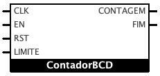
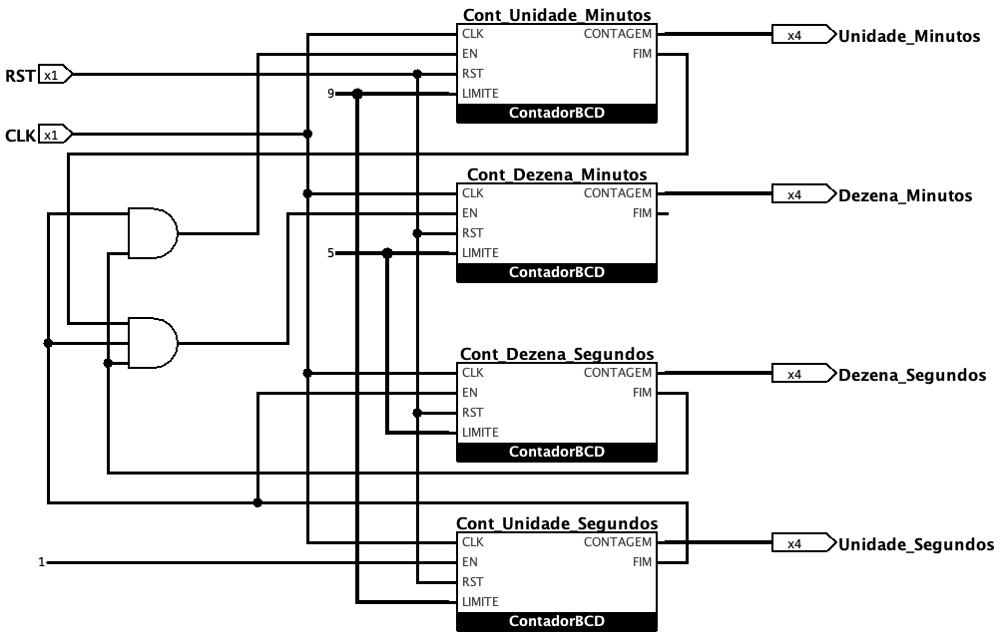

# Relógio Digital em VHDL
### Este projeto implementa um relógio digital em VHDL a partir de contadores síncronos BCD.

O contador BCD aqui descrito realiza a contagem de 0 até um valor LIMITE determinado por uma entrada correspondente. Enquanto o contador se encontrar em seu último estado, uma saída FIM se mantém em nível lógico ALTO; em todas as outras contagens a saída FIM se mantém em nível lógico BAIXO. O diagrama em bloco abaixo representa o contador BCD.

  

A entrada CLK recebe o sinal de CLOCK; a contagem ocorre somente nas bordas de descida e enquanto uma entrada de habilitação EN estiver ativa. A entrada RST realiza uma operação de RESET assíncrona, levando o contador para seu estado inicial de contagem e a entrada LIMITE indica o limite da contagem.

A partir do contador BCD síncrono, foi implementado o relógio digital representado no diagrama abaixo:

  

O relógio realiza a contagem até 59min59seg.
